# 设计文档（商用级 / 生产级 / 高可用版）

## 概述

本系统采用 **Master Cluster（主控集群）+ 子节点（Node）** 的分布式高可用架构，使用 Go 语言开发。主控以多实例集群方式部署，通过 etcd 或内置 Raft 协议进行 Leader 选举；Redis 负责节点在线状态与心跳的高频存储；PostgreSQL 负责配置数据的持久化；平台 API 调用通过 Redis Queue / Kafka 异步化；子节点支持流量混淆、连接复用、质量指标上报、WAL 持久化和本地快照恢复。

系统核心设计目标：
- **多主控高可用**：Leader 故障 10 秒内完成选举切换，节点无感知重连
- **配置下发一致性**：rule_version + ACK 机制防止脑裂，Leader 切换后自动补发未确认规则
- **节点侧持久化**：WAL + 快照保障节点重启和主控故障时的转发连续性
- **黑洞节点检测**：主控主动 TCP 探活，识别被运营商丢包的节点
- **节点信誉系统**：基于历史表现的信誉分，驱动调度优先级和观察名单
- **多平台差异化调度**：平台级调度策略覆盖全局默认策略
- **成本控制**：低利用率节点检测与自动/手动回收机制
- **智能调度**：基于权重、延迟、成功率、连接数、信誉分的综合评分调度
- **流量混淆**：TLS/HTTP 伪装、随机端口、连接复用、随机填充
- **灰度发布**：新节点先进灰度区观察，达标后晋升正式区
- **异步解耦**：平台 API 调用全部异步化，慢响应不影响主控调度
- **多租户隔离**：一套集群服务多个租户，数据和权限完全隔离
- **配置版本控制**：所有配置变更可追溯、可回滚

---

## 架构

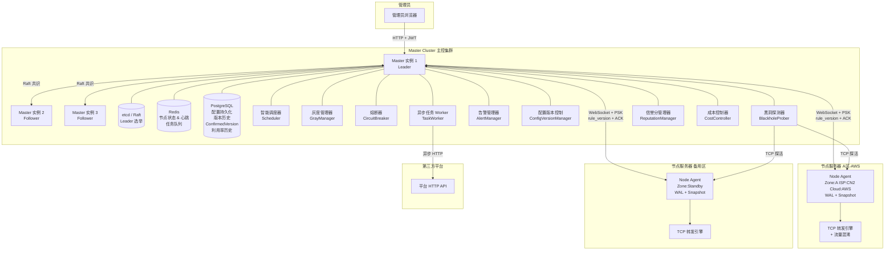

### 数据存储分层

| 数据类型 | 存储介质 | 原因 |
|---------|---------|------|
| 节点在线状态、最新心跳 | Redis（Hash + TTL） | 高频写，毫秒级读取 |
| 节点 HealthMetrics | Redis（Sorted Set） | 高频写，支持范围查询 |
| 任务队列 | Redis List / Kafka Topic | 高吞吐，支持消费者组 |
| 平台配置、节点配置 | PostgreSQL | 低频写，强一致性 |
| 转发规则、配置版本 | PostgreSQL | 低频写，需要事务 |
| 节点 ConfirmedVersion | PostgreSQL | 需要持久化，Leader 切换后读取 |
| 节点利用率历史（24h） | PostgreSQL（时序表） | 时序数据，按时间查询 |
| 节点信誉分及变更历史 | PostgreSQL | 低频写，需要持久化 |
| 告警记录、故障转移日志 | PostgreSQL | 低频写，需要持久化 |
| 心跳历史（7天） | PostgreSQL（分区表） | 时序数据，按时间分区 |
| 节点回收日志 | PostgreSQL | 低频写，需要持久化 |

---

## 组件与接口

### 2.1 主控 HTTP API 服务

提供 RESTful 管理接口，所有接口（除登录外）需携带有效 JWT Token。多租户模式下，Token 中包含租户 ID，接口层自动过滤数据范围。

#### 认证接口

| 方法 | 路径 | 描述 |
|------|------|------|
| POST | `/api/v1/auth/login` | 管理员登录，返回 JWT Token |
| POST | `/api/v1/auth/logout` | 登出（客户端丢弃 Token） |

#### 平台管理接口

| 方法 | 路径 | 描述 |
|------|------|------|
| GET | `/api/v1/platforms` | 获取平台列表（租户隔离） |
| POST | `/api/v1/platforms` | 新增平台 |
| PUT | `/api/v1/platforms/:id` | 修改平台配置（自动创建 ConfigVersion） |
| DELETE | `/api/v1/platforms/:id` | 删除平台（有关联节点时拒绝） |
| POST | `/api/v1/platforms/:id/test` | 测试平台接口连通性 |
| GET | `/api/v1/platforms/:id/versions` | 查询平台配置版本历史 |
| POST | `/api/v1/platforms/:id/rollback` | 回滚平台配置到指定版本 |
| GET | `/api/v1/platforms/:id/schedule-policy` | 获取平台调度策略 |
| PUT | `/api/v1/platforms/:id/schedule-policy` | 更新平台调度策略 |

#### 节点管理接口

| 方法 | 路径 | 描述 |
|------|------|------|
| GET | `/api/v1/nodes` | 获取节点列表（支持按平台、区域、ISP、标签筛选） |
| POST | `/api/v1/nodes` | 新增节点配置（默认进入灰度区） |
| GET | `/api/v1/nodes/:id` | 获取节点详情（含信誉分、ConfirmedVersion） |
| PUT | `/api/v1/nodes/:id` | 修改节点配置 |
| DELETE | `/api/v1/nodes/:id` | 删除节点 |
| POST | `/api/v1/nodes/:id/enable` | 启用节点转发 |
| POST | `/api/v1/nodes/:id/disable` | 禁用节点转发 |
| POST | `/api/v1/nodes/:id/promote` | 手动晋升节点（灰度区→正式区） |
| POST | `/api/v1/nodes/:id/demote` | 手动降级节点（正式区→灰度区） |
| POST | `/api/v1/nodes/:id/labels` | 更新节点标签 |
| POST | `/api/v1/nodes/:id/reclaim` | 手动触发节点回收 |
| GET | `/api/v1/nodes/:id/utilization` | 查询节点利用率历史 |
| GET | `/api/v1/nodes/:id/reputation` | 查询节点信誉分历史 |
| POST | `/api/v1/nodes/batch-rule` | 批量下发转发规则 |

#### 监控接口

| 方法 | 路径 | 描述 |
|------|------|------|
| GET | `/api/v1/monitor/overview` | 获取系统概览（节点统计、集群状态、告警数） |
| GET | `/api/v1/monitor/nodes` | 获取所有节点实时状态（含 HealthMetrics、ProbeRTT、信誉分） |
| GET | `/api/v1/monitor/heartbeats` | 查询节点心跳历史记录 |
| GET | `/api/v1/monitor/cluster` | 获取 Master Cluster 成员状态和 Leader 信息 |

#### 告警接口

| 方法 | 路径 | 描述 |
|------|------|------|
| GET | `/api/v1/alerts` | 查询告警列表（支持筛选） |
| PUT | `/api/v1/alerts/:id/resolve` | 手动标记告警为已解决 |

#### 任务队列接口

| 方法 | 路径 | 描述 |
|------|------|------|
| GET | `/api/v1/tasks/dlq` | 查询死信队列中的失败任务 |
| POST | `/api/v1/tasks/dlq/:id/retry` | 手动重试死信队列中的任务 |

#### 租户管理接口（超级管理员）

| 方法 | 路径 | 描述 |
|------|------|------|
| GET | `/api/v1/tenants` | 获取租户列表 |
| POST | `/api/v1/tenants` | 创建租户 |
| PUT | `/api/v1/tenants/:id` | 修改租户配置（配额等） |

---

### 2.2 WebSocket 控制通道

节点连接地址：`ws://master-leader:8081/ws/node`

握手阶段节点需在 HTTP Header 中携带：
- `X-Node-PSK`：预共享密钥
- `X-Node-ID`：节点唯一标识（首次注册时为空，主控分配后使用）
- `X-Tenant-ID`：所属租户 ID

#### 消息格式

```json
{
  "type": "消息类型",
  "seq":  12345,
  "payload": {}
}
```

#### 消息类型定义

| 方向 | 类型 | 描述 |
|------|------|------|
| Node → Master | `register` | 节点注册（含 ISP、CloudProvider、标签） |
| Master → Node | `register_ack` | 注册确认，返回节点 ID 和当前 Leader 地址 |
| Node → Master | `heartbeat` | 心跳包（含 HealthMetrics） |
| Master → Node | `heartbeat_ack` | 心跳确认 |
| Master → Node | `apply_rules` | 下发转发规则列表（含 rule_version 和混淆配置） |
| Node → Master | `rule_ack` | 规则应用确认，携带已确认的 rule_version |
| Node → Master | `rules_result` | 规则应用详细结果（含错误信息） |
| Master → Node | `disable_forward` | 禁用所有转发 |
| Node → Master | `status_report` | 节点主动上报状态变化 |
| Master → Node | `leader_redirect` | 通知节点重连到新 Leader |
| Master → Node | `update_obfuscation` | 更新流量混淆配置 |
| Master → Node | `probe_request` | 主控发起探活请求（用于黑洞检测） |
| Node → Master | `probe_response` | 节点回复探活响应（含时间戳） |

#### apply_rules Payload（含 rule_version）

```json
{
  "type": "apply_rules",
  "seq": 100,
  "payload": {
    "rule_version": 42,
    "rules": [
      {
        "rule_id": "r-001",
        "local_port": 10001,
        "target_ip": "10.0.0.1",
        "target_port": 8080,
        "enabled": true,
        "obfuscation": {
          "mode": "tls",
          "random_port_range": [10000, 20000],
          "max_bandwidth_mbps": 100,
          "mux_enabled": true
        }
      }
    ]
  }
}
```

#### rule_ack Payload

```json
{
  "type": "rule_ack",
  "seq": 101,
  "payload": {
    "node_id": "node-001",
    "rule_version": 42,
    "status": "applied",
    "timestamp": 1700000000
  }
}
```

---

### 2.3 配置下发一致性（rule_version + ACK 机制）

#### 时序图：正常下发流程

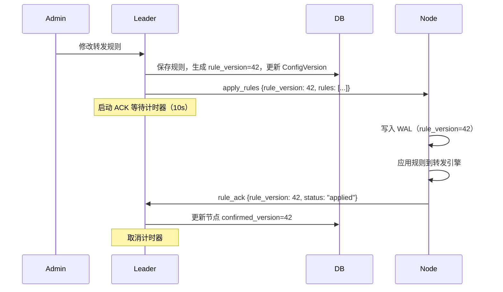

#### 时序图：ACK 超时重试流程

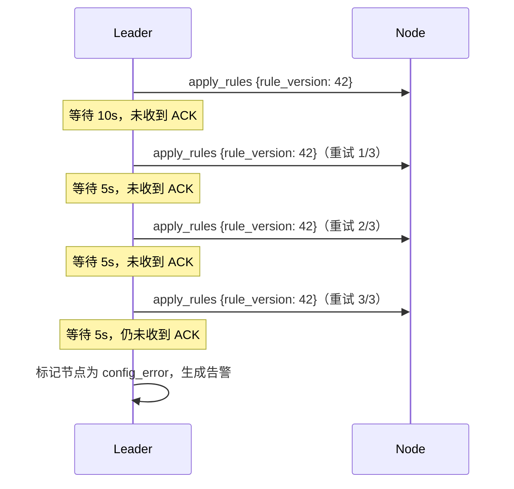

#### 时序图：Leader 切换后补发未确认规则

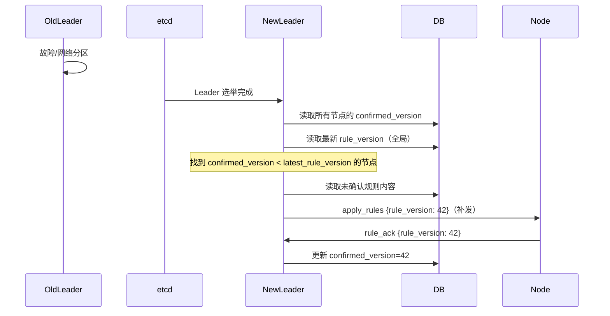

#### 节点侧版本过滤逻辑

```
收到 apply_rules 消息时：
  if rule_version <= node.current_applied_version:
    // 丢弃旧版本规则，直接回复 ACK（携带当前版本号）
    send rule_ack {rule_version: node.current_applied_version}
    return
  // 写 WAL → 应用规则 → 更新 current_applied_version → 回复 ACK
```

---

### 2.4 节点侧 WAL + 快照数据流设计

#### WAL 文件格式

每行一条 JSON 记录：

```json
{"op":"apply","rule_version":42,"rule":{"rule_id":"r-001","local_port":10001,"target_ip":"10.0.0.1","target_port":8080,"enabled":true},"timestamp":1700000000}
{"op":"disable","rule_version":43,"rule_id":"r-001","timestamp":1700000060}
```

#### 快照文件格式

```json
{
  "snapshot_version": 42,
  "snapshot_time": 1700000000,
  "rules": [
    {"rule_id":"r-001","local_port":10001,"target_ip":"10.0.0.1","target_port":8080,"enabled":true,"rule_version":42}
  ]
}
```

#### 重启恢复数据流

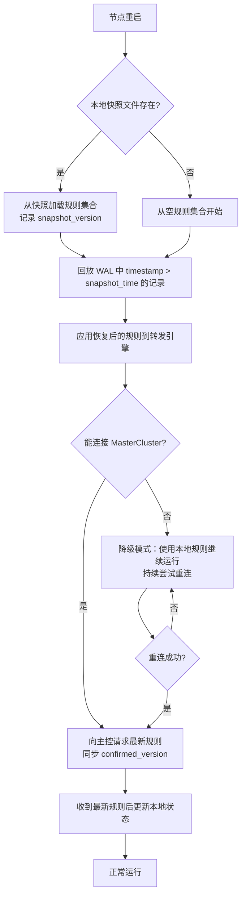

#### WAL 清理策略

- 每次成功写入快照后，删除快照时间戳之前的所有 WAL 记录
- WAL 文件按天滚动，保留最近 3 天的 WAL 文件
- 快照文件只保留最新的 2 个版本

---

### 2.5 黑洞节点检测流程

#### 探活架构

主控的 `BlackholeProber` 组件每 60 秒对所有在线节点的转发端口发起 TCP 探活：

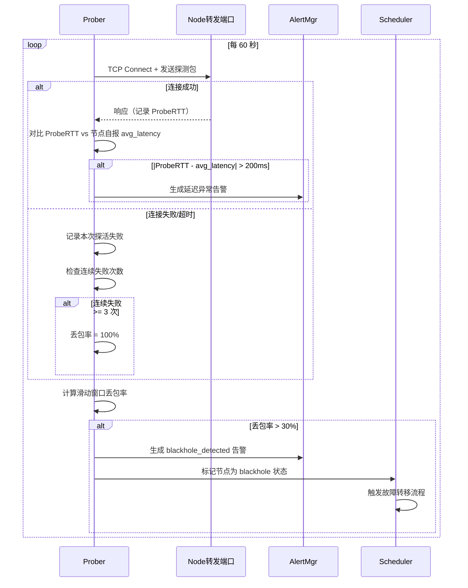

#### 黑洞状态恢复

- 节点被标记为 `blackhole` 后，探活仍继续运行
- 连续 5 次探活成功且 ProbeRTT 与 avg_latency 差值 < 100ms，自动解除 `blackhole` 状态
- 解除后节点进入 GrayZone 重新观察，不直接恢复为正式区节点

---

### 2.6 Leader 选举与高可用设计

#### etcd 方案

```
1. 每个 Master 实例启动时尝试创建 /master/leader key（带 TTL=15s）
2. 创建成功的实例成为 Leader，定期续约（每 5s）
3. 其他实例 Watch /master/leader key，Leader 失联后 TTL 到期，key 消失
4. 剩余实例重新竞争创建 key，最先成功者成为新 Leader
5. 新 Leader 向所有节点广播 leader_redirect 消息
6. 新 Leader 从 DB 读取所有节点的 confirmed_version，补发未确认规则
```

#### 节点重连策略

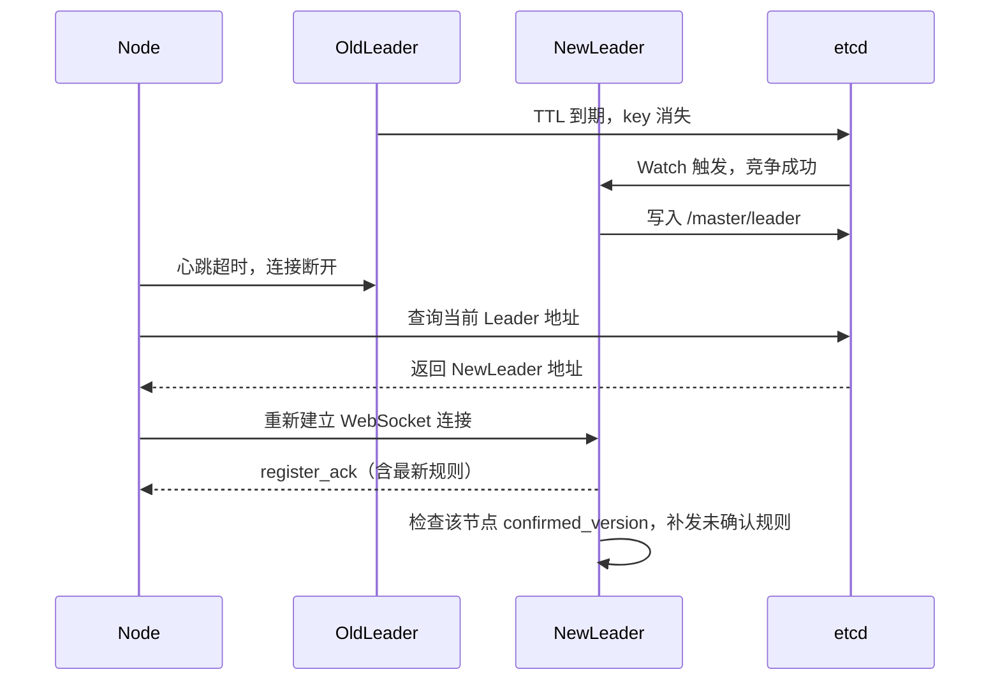

---

### 2.7 智能调度器（Scheduler）

#### 综合评分算法（含信誉分）

```
Score(node) = W_weight     * normalize(node.weight, 0, 200)
            + W_latency    * (1 - normalize(avg_latency, 0, 500))
            + W_success    * success_rate
            + W_conn       * (1 - normalize(active_conns, 0, max_conns))
            + W_bw         * (1 - normalize(bandwidth_mbps, 0, max_bandwidth))
            + W_reputation * normalize(reputation_score, 0, 100)

默认权重：
W_weight = 0.25, W_latency = 0.20, W_success = 0.20
W_conn = 0.10, W_bw = 0.10, W_reputation = 0.15
```

#### 调度流程（含平台策略和信誉分过滤）

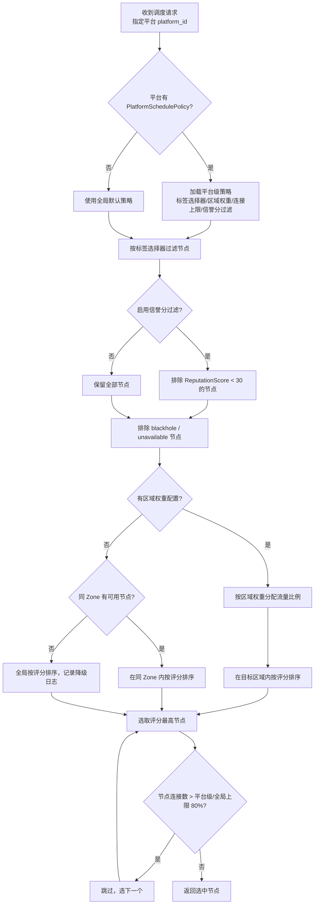

---

### 2.8 节点信誉分管理器（ReputationManager）

#### 信誉分计算公式

信誉分基于以下事件驱动更新（非周期性重算）：

```
初始值：reputation_score = 80

每小时检查：
  IF 节点在线时长 = 60 分钟 AND 该小时平均成功率 >= 0.95:
    reputation_score = min(100, reputation_score + 1)

事件触发：
  故障转移（被替换）：reputation_score = max(0, reputation_score - 10)
  黑洞检测触发：     reputation_score = max(0, reputation_score - 20)
  灰度观察失败：     reputation_score = max(0, reputation_score - 5)
```

#### 观察名单逻辑

- `reputation_score < 30`：自动加入观察名单，调度器跳过该节点（正式区）
- 观察名单中的节点仍可作为备用节点参与故障转移
- 信誉分恢复到 ≥ 30 后，自动移出观察名单，重新参与正式区调度

---

### 2.9 多平台差异化调度策略

#### PlatformSchedulePolicy 数据模型

```go
type PlatformSchedulePolicy struct {
    PlatformID        uint              `json:"platform_id"`
    LabelSelector     []LabelRequirement `json:"label_selector"`     // 优先标签选择器
    ZoneWeights       map[string]int    `json:"zone_weights"`        // 区域权重，如 {"A":50,"B":30,"C":20}
    MaxConnsPerNode   int               `json:"max_conns_per_node"`  // 覆盖全局 max_conns，0 表示使用全局
    EnableRepFilter   bool              `json:"enable_rep_filter"`   // 是否启用信誉分过滤
    UpdatedAt         time.Time         `json:"updated_at"`
}

type LabelRequirement struct {
    Key      string `json:"key"`
    Operator string `json:"operator"` // "In" | "NotIn" | "Exists"
    Values   []string `json:"values"`
}
```

#### 策略优先级

```
平台级策略 > 全局默认策略

平台级策略中各字段的覆盖规则：
- LabelSelector：完全替换全局标签选择器
- ZoneWeights：启用区域权重调度（全局默认为 Zone 优先但无权重）
- MaxConnsPerNode：覆盖节点的全局 max_conns（仅用于该平台的调度判断）
- EnableRepFilter：独立控制，不受全局配置影响
```

---

### 2.10 成本控制器（CostController）

#### 利用率统计与低利用率检测

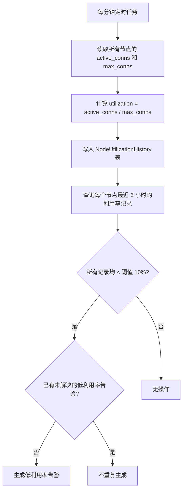

#### 节点回收流程

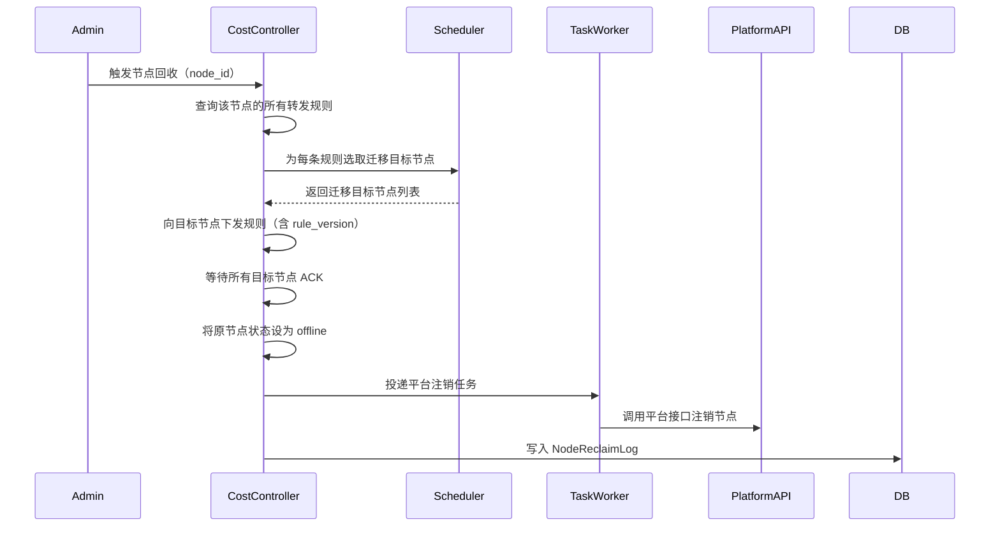

---

### 2.11 灰度管理器（GrayManager）

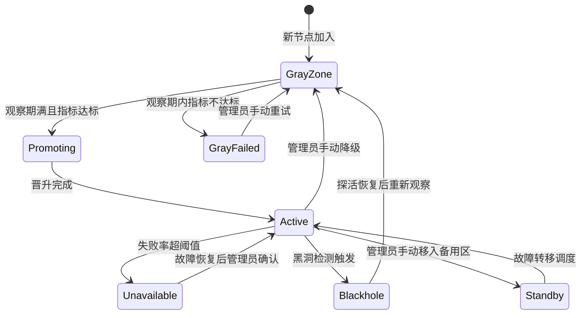

---

### 2.12 异步任务队列（TaskQueue）

所有平台 API 调用通过 TaskQueue 异步化：

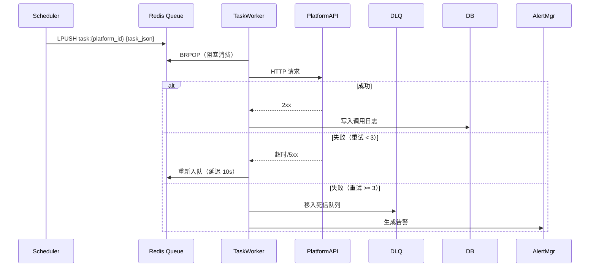

---

### 2.13 熔断器（CircuitBreaker）

每个平台独立一个 CircuitBreaker，状态机：

```
Closed（正常）→ Open（断开）→ HalfOpen（探活）→ Closed（恢复）
                ↑                    ↓
           失败率 > 阈值         探活失败，重新 Open
```

- **Closed → Open**：60 秒内连续失败 > 5 次
- **Open → HalfOpen**：冷却期 30 秒后
- **HalfOpen → Closed**：探活请求成功
- **HalfOpen → Open**：探活请求失败

---

### 2.14 流量混淆引擎（Node 侧）

| 模式 | 实现方式 |
|------|---------|
| `tls` | 在转发端口上提供合法 TLS 握手，使用自签名证书 |
| `http` | 将转发流量封装在 HTTP/1.1 或 WebSocket 帧中 |
| `plain` | 不混淆，直接 TCP 转发（默认） |

附加能力：随机端口、连接复用（yamux/smux）、令牌桶限速、随机填充（0~64 字节）、IP 限流（滑动窗口）

---

### 2.15 配置版本控制（ConfigVersionManager）

回滚流程：
1. 查询目标版本的 Snapshot
2. 将 Snapshot 反序列化为对应资源对象
3. 覆盖写入数据库（创建新版本记录，标注为回滚操作）
4. 向相关节点重新下发规则（携带新的 rule_version）

---

## 数据模型

### Tenant（租户）

```go
type Tenant struct {
    ID        uint      `json:"id"`
    Name      string    `json:"name"`
    APIQuota  int       `json:"api_quota"`
    Status    string    `json:"status"` // "active" | "suspended"
    CreatedAt time.Time `json:"created_at"`
}
```

### Platform（平台）

```go
type Platform struct {
    ID        uint      `json:"id"`
    TenantID  uint      `json:"tenant_id"`
    Name      string    `json:"name"`
    APIURL    string    `json:"api_url"`
    APIKey    string    `json:"api_key"` // 加密存储
    Origins   []Origin  `json:"origins"`
    CreatedAt time.Time `json:"created_at"`
    UpdatedAt time.Time `json:"updated_at"`
}

type Origin struct {
    ID         uint   `json:"id"`
    PlatformID uint   `json:"platform_id"`
    Type       string `json:"type"` // "bytedance" | "dedicated"
    IP         string `json:"ip"`
    Port       int    `json:"port"`
    Priority   int    `json:"priority"`
}
```

### PlatformSchedulePolicy（平台调度策略）

```go
type PlatformSchedulePolicy struct {
    PlatformID      uint               `json:"platform_id"`
    LabelSelector   []LabelRequirement `json:"label_selector"`
    ZoneWeights     map[string]int     `json:"zone_weights"`      // {"A":50,"B":30,"C":20}
    MaxConnsPerNode int                `json:"max_conns_per_node"` // 0 = 使用全局
    EnableRepFilter bool               `json:"enable_rep_filter"`
    UpdatedAt       time.Time          `json:"updated_at"`
}

type LabelRequirement struct {
    Key      string   `json:"key"`
    Operator string   `json:"operator"` // "In" | "NotIn" | "Exists"
    Values   []string `json:"values"`
}
```

### Node（节点）

```go
type Node struct {
    ID               uint        `json:"id"`
    TenantID         uint        `json:"tenant_id"`
    IP               string      `json:"ip"`
    PlatformID       uint        `json:"platform_id"`
    OriginID         uint        `json:"origin_id"`
    ForwardPort      int         `json:"forward_port"`
    Zone             string      `json:"zone"`          // "A"|"B"|"C"|"D"|"standby"|"gray"
    ISP              string      `json:"isp"`
    CloudProvider    string      `json:"cloud_provider"`
    Labels           []NodeLabel `json:"labels"`
    Weight           int         `json:"weight"`
    MaxConns         int         `json:"max_conns"`
    MaxBandwidth     float64     `json:"max_bandwidth"`
    Status           string      `json:"status"` // "online"|"offline"|"unavailable"|"config_error"|"quality_degraded"|"gray_failed"|"blackhole"|"standby"
    ReputationScore  int         `json:"reputation_score"`  // 0~100，初始 80
    ConfirmedVersion int64       `json:"confirmed_version"` // 最后一次 ACK 的 rule_version
    GrayStartAt      *time.Time  `json:"gray_start_at,omitempty"`
    LastHeartbeat    time.Time   `json:"last_heartbeat"`
    CreatedAt        time.Time   `json:"created_at"`
    UpdatedAt        time.Time   `json:"updated_at"`
}
```

### NodeLabel（节点标签）

```go
type NodeLabel struct {
    ID     uint   `json:"id"`
    NodeID uint   `json:"node_id"`
    Key    string `json:"key"`
    Value  string `json:"value"`
}
```

### NodeHealthMetrics（节点健康指标，存 Redis）

```go
type NodeHealthMetrics struct {
    NodeID        string    `json:"node_id"`
    SuccessRate   float64   `json:"success_rate"`
    AvgLatency    int       `json:"avg_latency"`
    ConnFail      int       `json:"conn_fail"`
    ActiveConns   int       `json:"active_conns"`
    BandwidthMbps float64   `json:"bandwidth_mbps"`
    UpdatedAt     time.Time `json:"updated_at"`
}
```

### NodeProbeResult（探活结果，存 Redis）

```go
type NodeProbeResult struct {
    NodeID       string    `json:"node_id"`
    ProbeRTT     int       `json:"probe_rtt"`       // 毫秒，-1 表示失败
    PacketLoss   float64   `json:"packet_loss"`     // 0.0~1.0
    ConsecFail   int       `json:"consec_fail"`     // 连续失败次数
    LastProbeAt  time.Time `json:"last_probe_at"`
}
```

### ForwardRule（转发规则）

```go
type ForwardRule struct {
    ID          uint              `json:"id"`
    NodeID      uint              `json:"node_id"`
    RuleVersion int64             `json:"rule_version"` // 单调递增版本号
    LocalPort   int               `json:"local_port"`
    TargetIP    string            `json:"target_ip"`
    TargetPort  int               `json:"target_port"`
    Enabled     bool              `json:"enabled"`
    Obfuscation ObfuscationConfig `json:"obfuscation"`
}

type ObfuscationConfig struct {
    Mode             string  `json:"mode"`               // "plain"|"tls"|"http"
    RandomPortRange  [2]int  `json:"random_port_range"`
    MaxBandwidthMbps float64 `json:"max_bandwidth_mbps"`
    MuxEnabled       bool    `json:"mux_enabled"`
    RandomPadding    bool    `json:"random_padding"`
}
```

### Alert（告警）

```go
type Alert struct {
    ID         uint       `json:"id"`
    TenantID   uint       `json:"tenant_id"`
    NodeID     uint       `json:"node_id"`
    PlatformID uint       `json:"platform_id"`
    Type       string     `json:"type"` // "node_offline"|"standby_exhausted"|"quality_degraded"|"gray_failed"|"circuit_open"|"blackhole_detected"|"low_utilization"|"rule_ack_timeout"
    Message    string     `json:"message"`
    Status     string     `json:"status"` // "active" | "resolved"
    CreatedAt  time.Time  `json:"created_at"`
    ResolvedAt *time.Time `json:"resolved_at,omitempty"`
}
```

### FailoverLog（故障转移日志）

```go
type FailoverLog struct {
    ID                uint      `json:"id"`
    TenantID          uint      `json:"tenant_id"`
    FailedNodeID      uint      `json:"failed_node_id"`
    StandbyNodeID     *uint     `json:"standby_node_id,omitempty"`
    PlatformID        uint      `json:"platform_id"`
    TriggerReason     string    `json:"trigger_reason"` // "heartbeat_timeout"|"quality_threshold"|"blackhole_detected"
    TriggerTime       time.Time `json:"trigger_time"`
    PlatformAPIResult string    `json:"platform_api_result"`
    Notes             string    `json:"notes"`
}
```

### NodeReputationLog（信誉分变更日志）

```go
type NodeReputationLog struct {
    ID        uint      `json:"id"`
    NodeID    uint      `json:"node_id"`
    OldScore  int       `json:"old_score"`
    NewScore  int       `json:"new_score"`
    Delta     int       `json:"delta"`
    Reason    string    `json:"reason"` // "hourly_online"|"failover"|"blackhole"|"gray_failed"
    CreatedAt time.Time `json:"created_at"`
}
```

### NodeUtilizationHistory（节点利用率历史）

```go
type NodeUtilizationHistory struct {
    ID          uint      `json:"id"`
    NodeID      uint      `json:"node_id"`
    Utilization float64   `json:"utilization"` // active_conns / max_conns
    ActiveConns int       `json:"active_conns"`
    MaxConns    int       `json:"max_conns"`
    RecordedAt  time.Time `json:"recorded_at"`
}
```

### NodeReclaimLog（节点回收日志）

```go
type NodeReclaimLog struct {
    ID                uint      `json:"id"`
    NodeID            uint      `json:"node_id"`
    TriggerType       string    `json:"trigger_type"` // "manual" | "auto"
    MigratedToNodes   []uint    `json:"migrated_to_nodes"`
    PlatformAPIResult string    `json:"platform_api_result"`
    ReclaimedAt       time.Time `json:"reclaimed_at"`
}
```

### ConfigVersion（配置版本）

```go
type ConfigVersion struct {
    ID            uint            `json:"id"`
    TenantID      uint            `json:"tenant_id"`
    ResourceType  string          `json:"resource_type"`
    ResourceID    uint            `json:"resource_id"`
    Version       int             `json:"version"`
    Snapshot      json.RawMessage `json:"snapshot"`
    ChangedBy     uint            `json:"changed_by"`
    ChangeSummary string          `json:"change_summary"`
    IsRollback    bool            `json:"is_rollback"`
    CreatedAt     time.Time       `json:"created_at"`
}
```

### GrayObservationRecord（灰度观察记录）

```go
type GrayObservationRecord struct {
    ID          uint      `json:"id"`
    NodeID      uint      `json:"node_id"`
    SampledAt   time.Time `json:"sampled_at"`
    SuccessRate float64   `json:"success_rate"`
    AvgLatency  int       `json:"avg_latency"`
    Outcome     string    `json:"outcome"` // "promoted"|"failed"|"observing"
}
```

### PlatformTask（异步任务）

```go
type PlatformTask struct {
    TaskID     string    `json:"task_id"`
    TenantID   uint      `json:"tenant_id"`
    Type       string    `json:"type"` // "register" | "deregister" | "reclaim"
    PlatformID uint      `json:"platform_id"`
    NodeIP     string    `json:"node_ip"`
    NodePort   int       `json:"node_port"`
    RetryCount int       `json:"retry_count"`
    CreatedAt  time.Time `json:"created_at"`
}
```

---

## 正确性属性

*属性（Property）是在系统所有合法执行路径上都应成立的特征或行为——本质上是对系统应做什么的形式化陈述。属性是人类可读规范与机器可验证正确性保证之间的桥梁。*

### Property 1：心跳超时检测的单调性

*对于任意节点，若其最后心跳时间距当前时间超过 90 秒，则该节点的状态必须为"离线"或"不可用"，不可能仍为"在线"。*

**Validates: Requirements 1.3**

---

### Property 2：质量降级触发的一致性

*对于任意节点，若其 HealthMetrics 中成功率 < 0.90 或平均延迟 > 500ms，则该节点的状态必须为"质量降级"或"不可用"，不可能仍为"在线（正常）"。*

**Validates: Requirements 1.7, 4.7**

---

### Property 3：故障转移后备用节点规则一致性

*对于任意发生故障转移的事件，被调度上来的备用节点所持有的转发规则集合，必须与故障节点在故障前持有的转发规则集合完全相同（rule_id、local_port、target_ip、target_port 全部一致）。*

**Validates: Requirements 4.2**

---

### Property 4：转发规则端口状态一致性

*对于任意节点，其所有 enabled=true 的转发规则对应的本地端口必须处于监听状态；所有 enabled=false 的规则对应的本地端口必须处于关闭状态。不存在规则状态与端口状态不一致的情况。*

**Validates: Requirements 5.1, 5.2, 5.3**

---

### Property 5：转发规则应用的幂等性

*对于任意节点，向其重复下发相同的转发规则集合（相同 rule_version），节点最终的运行状态与只下发一次的结果相同（端口监听数量不变，不会重复开启）。*

**Validates: Requirements 5.1, 5.4, 18.6**

---

### Property 6：HealthMetrics 上报完整性

*对于任意节点，其每次心跳包中必须包含所有当前活跃转发规则的指标数据（success_rate、avg_latency、conn_fail、active_conns），不存在有活跃规则但心跳中缺少对应指标的情况。*

**Validates: Requirements 5.7**

---

### Property 7：平台接口调用日志完整性

*对于任意一次平台接口调用（上线或下线），系统必须记录一条对应的调用日志，日志包含请求参数、响应内容和耗时，不存在无日志的调用。*

**Validates: Requirements 8.4**

---

### Property 8：任务队列重试次数上限

*对于任意失败的平台 API 调用任务，TaskQueue Worker 的重试次数不超过 3 次；超过 3 次后任务必须进入死信队列，不再自动重试。*

**Validates: Requirements 8.3**

---

### Property 9：熔断器状态转换正确性

*对于任意平台，若在 60 秒内连续失败次数超过 5 次，则 CircuitBreaker 必须处于 Open 状态；处于 Open 状态时，所有新的 API 调用必须被拒绝，不发出实际 HTTP 请求。*

**Validates: Requirements 8.6, 16.1, 16.2**

---

### Property 10：节点状态与告警的一致性

*对于任意节点，若其状态为"不可用"或"blackhole"，则系统中必须存在至少一条与该节点关联的"active"状态告警；若节点恢复在线，则所有关联告警必须被标记为"已恢复"。*

**Validates: Requirements 4.1, 7.5, 20.4**

---

### Property 11：调度评分单调性（含信誉分）

*对于任意两个节点 A 和 B，若 A 的成功率更高、延迟更低、连接数更少、信誉分更高，则 A 的综合评分必须高于 B；评分更高的节点在调度时必须优先被选中（在其他条件相同的情况下）。*

**Validates: Requirements 11.1, 11.2, 22.4**

---

### Property 12：超载节点不参与调度

*对于任意节点，若其当前活跃连接数超过有效 max_conns（平台级或全局）的 80%，则调度器在选取节点时必须跳过该节点，不将新连接分配给它。*

**Validates: Requirements 11.5, 23.5**

---

### Property 13：灰度晋升条件一致性

*对于任意处于灰度区的节点，若其观察期内平均成功率 ≥ 0.95 且平均延迟 ≤ 200ms，则该节点必须被晋升到正式区；若不满足条件，则不得晋升。*

**Validates: Requirements 12.3, 12.4**

---

### Property 14：配置变更版本记录完整性

*对于任意一次平台配置、节点配置或转发规则的变更操作，系统必须创建一条对应的 ConfigVersion 记录，包含变更前后的完整快照；不存在无版本记录的配置变更。*

**Validates: Requirements 17.1**

---

### Property 15：配置版本回滚往返一致性

*对于任意合法的配置对象，将其保存（创建版本 V1），再修改（创建版本 V2），再回滚到 V1，最终读取到的配置必须与 V1 的快照完全一致。*

**Validates: Requirements 17.3**

---

### Property 16：规则序列化往返一致性

*对于任意合法的 ForwardRule 对象（含 ObfuscationConfig 和 rule_version），将其序列化为 JSON 后再反序列化，得到的对象与原始对象在所有字段上完全相等。*

**Validates: Requirements 5.1, 5.2, 18.1**

---

### Property 17：备用区节点唯一调度

*对于任意一次故障转移，同一个备用节点不能同时被调度去替换两个不同的故障节点（备用节点在同一时刻只能服务一个故障替换任务）。*

**Validates: Requirements 4.2**

---

### Property 18：多主控状态视图一致性

*对于任意节点状态写入操作（写入 Redis），所有 Master 实例在写入完成后读取到的该节点状态必须相同，不存在不同实例看到不同状态的情况。*

**Validates: Requirements 10.5**

---

### Property 19：租户数据隔离性

*对于任意两个不同租户 A 和 B，租户 A 的管理员通过 API 查询到的节点列表、平台列表中，不包含任何属于租户 B 的资源。*

**Validates: Requirements 15.2**

---

### Property 20：规则版本单调性（含节点侧过滤）

*对于任意节点，其已应用的规则版本号序列必须严格单调递增；节点必须拒绝（丢弃）所有 rule_version ≤ 当前已应用版本号的规则下发，不重复应用旧版本规则。*

**Validates: Requirements 18.1, 18.6**

---

### Property 21：WAL + 快照恢复往返一致性

*对于任意节点，在应用一组规则变更后触发快照，再模拟重启（先加载快照，再回放 WAL），恢复后的规则集合必须与重启前完全一致（rule_id、rule_version、enabled 状态全部相同）。*

**Validates: Requirements 19.1, 19.2, 19.3**

---

### Property 22：黑洞检测告警触发条件

*对于任意节点的探活序列，若探活丢包率超过 30%（即连续 3 次失败或滑动窗口内失败比例 > 30%），则必须生成 `blackhole_detected` 告警，且节点状态必须变为 `blackhole`；若丢包率未超过阈值，则不得触发黑洞告警。*

**Validates: Requirements 20.3, 20.4**

---

### Property 23：信誉分边界与更新正确性

*对于任意节点，其 ReputationScore 必须始终在 [0, 100] 范围内；对于任意信誉分更新事件（+1/-5/-10/-20），更新后的分数必须等于 clamp(old_score + delta, 0, 100)，不存在越界情况。*

**Validates: Requirements 22.1, 22.2**

---

### Property 24：低信誉节点不参与正式区调度

*对于任意 ReputationScore < 30 的节点，调度器在为正式区选取节点时必须跳过该节点；该节点不应出现在任何正式区调度结果中。*

**Validates: Requirements 11.8, 22.3**

---

### Property 25：平台级调度策略优先性

*对于任意配置了 PlatformSchedulePolicy 的平台，调度器在为该平台选取节点时，必须使用平台级策略中的参数（标签选择器、连接上限、信誉分过滤）而非全局默认参数；全局参数仅在平台未配置对应字段时生效。*

**Validates: Requirements 23.2, 23.5**

---

### Property 26：节点利用率计算正确性

*对于任意节点，其 NodeUtilization 必须等于 active_conns / max_conns；对于任意连续 6 小时利用率历史记录，若所有记录均低于配置阈值，则必须生成低利用率告警。*

**Validates: Requirements 21.1, 21.2**

---

### Property 27：ACK 重试次数上限

*对于任意规则下发后未收到 ACK 的场景，主控的重试次数不超过 3 次（初次下发 + 3 次重试）；超过重试次数后必须将节点标记为 `config_error`，不再自动重试该规则版本。*

**Validates: Requirements 18.4, 18.5**

---

### Property 28：节点回收规则迁移一致性

*对于任意一次节点回收操作，被回收节点上所有转发规则必须被完整迁移到目标节点；迁移完成后，目标节点持有的规则集合（rule_id、local_port、target_ip、target_port 全部一致）必须与被回收节点在回收前持有的规则集合完全相同，不存在规则遗漏或重复的情况。*

**Validates: Requirements 21.3**

---

## 错误处理

### 节点侧错误

| 错误场景 | 处理方式 |
|---------|---------|
| 端口被占用 | 返回 `port_conflict` 错误，主控标记节点为 `config_error` |
| WebSocket 连接断开 | 指数退避重连（1s, 2s, 4s, ... 最大 60s），优先连接当前 Leader |
| Leader 切换 | 收到 `leader_redirect` 消息后，立即重连到新 Leader 地址 |
| 规则应用失败 | 上报 `rules_result` 携带失败原因，主控记录并告警 |
| 重启后规则恢复失败 | 记录本地错误日志，向主控请求最新规则 |
| 混淆模式初始化失败 | 降级为 `plain` 模式，上报状态变更 |
| WAL 写入失败 | 拒绝应用规则，返回错误，主控重试 |
| 快照写入失败 | 记录错误日志，继续运行，下次定时任务重试 |
| 主控不可达（重启时） | 使用本地快照继续运行（降级模式），持续尝试重连 |
| 收到旧版本规则 | 丢弃规则，回复 ACK（携带当前已应用版本号） |

### 主控侧错误

| 错误场景 | 处理方式 |
|---------|---------|
| 平台接口调用失败 | 投入 TaskQueue，最多重试 3 次（间隔 10s），超限进入死信队列 |
| CircuitBreaker 断开 | 拒绝新调用，返回降级响应，30s 后探活 |
| 备用节点耗尽 | 生成 `standby_exhausted` 告警，通知管理员 |
| 数据库写入失败 | 返回 500 错误，记录错误日志，不影响已运行的转发 |
| 节点 PSK 验证失败 | 拒绝 WebSocket 握手，返回 401 |
| Leader 选举中 | 写操作返回 503，读操作继续服务 |
| Redis 连接失败 | 降级为本地内存缓存，记录告警，恢复后自动同步 |
| 灰度节点质量不达标 | 标记 `gray_failed`，生成告警，不自动晋升，信誉分 -5 |
| 配置回滚失败 | 记录回滚失败日志，生成告警，不自动重试 |
| 规则下发 ACK 超时 | 重试最多 3 次（间隔 5s），超限标记节点 `config_error`，生成 `rule_ack_timeout` 告警 |
| Leader 切换后补发规则失败 | 记录失败日志，生成告警，等待节点重连后再次尝试 |
| 黑洞探活失败 | 记录探活失败，累计连续失败次数，达到阈值触发黑洞告警 |
| 节点回收迁移失败 | 回滚回收操作，保持原节点在线，生成告警 |

---

## 测试策略

### 单元测试

针对以下模块编写单元测试：
- 心跳超时检测逻辑（Scheduler）
- HealthMetrics 质量阈值判断逻辑
- 综合评分计算算法（Scheduler，含信誉分权重）
- 调度节点选取逻辑（含标签过滤、Zone 隔离、超载跳过、信誉分过滤、平台级策略）
- 灰度晋升条件判断逻辑（GrayManager）
- 转发规则序列化/反序列化（ForwardRule + ObfuscationConfig + rule_version JSON）
- 平台接口客户端重试逻辑（TaskWorker）
- CircuitBreaker 状态机转换逻辑
- JWT Token 签发与验证
- PSK 握手验证逻辑
- 配置版本快照创建与回滚逻辑
- 租户数据隔离过滤逻辑
- rule_version 单调性检查逻辑（节点侧）
- ACK 超时重试逻辑（主控侧）
- WAL 写入与回放逻辑（节点侧）
- 快照生成与加载逻辑（节点侧）
- 黑洞探活 RTT 对比与丢包率计算逻辑（BlackholeProber）
- 信誉分更新与边界检查逻辑（ReputationManager）
- 节点利用率计算与低利用率检测逻辑（CostController）
- 平台级调度策略优先级逻辑（Scheduler）

### 属性测试（Property-Based Testing）

使用 Go 的 `pgregory.net/rapid` 库进行属性测试，每个属性测试运行最少 100 次迭代。

每个属性测试需在注释中标注对应的设计属性编号，格式：
`// Feature: master-node-pool-system, Property N: <属性描述>`

| 属性编号 | 测试内容 |
|---------|---------|
| Property 1 | 生成随机心跳时间，验证超时判断逻辑的正确性 |
| Property 2 | 生成随机 HealthMetrics，验证质量降级触发条件 |
| Property 3 | 生成随机转发规则集合，触发故障转移，验证备用节点规则一致性 |
| Property 4 | 生成随机规则集合，验证端口状态与规则 enabled 字段一致 |
| Property 5 | 生成随机规则集合（含 rule_version），重复下发，验证幂等性 |
| Property 6 | 生成随机活跃规则集合，验证心跳包中指标数据完整性 |
| Property 7 | 生成随机平台调用场景，验证日志记录完整性 |
| Property 8 | 生成随机失败场景，验证重试次数不超过 3 次 |
| Property 9 | 生成随机失败序列，验证熔断器在正确时机断开并拒绝调用 |
| Property 10 | 生成随机节点状态变化序列，验证告警状态一致性 |
| Property 11 | 生成随机节点指标对（含信誉分），验证评分单调性和调度优先级 |
| Property 12 | 生成随机节点池（含超载节点和平台级连接上限），验证超载节点不被选中 |
| Property 13 | 生成随机灰度观察数据，验证晋升条件判断正确性 |
| Property 14 | 生成随机配置变更序列，验证每次变更都有版本记录 |
| Property 15 | 生成随机配置对象，验证保存→修改→回滚后与原始一致 |
| Property 16 | 生成随机 ForwardRule（含 ObfuscationConfig 和 rule_version），验证 JSON 往返一致性 |
| Property 17 | 生成多个并发故障场景，验证备用节点不被重复调度 |
| Property 18 | 生成随机状态写入，验证多实例读取一致性 |
| Property 19 | 生成多租户随机查询，验证租户数据隔离性 |
| Property 20 | 生成随机规则版本序列，验证节点拒绝旧版本规则，版本号单调递增 |
| Property 21 | 生成随机规则变更序列，触发快照和 WAL，模拟重启，验证恢复后规则一致性 |
| Property 22 | 生成随机探活结果序列，验证黑洞告警触发条件（丢包率 > 30%） |
| Property 23 | 生成随机信誉分更新事件，验证分数始终在 [0,100] 范围内 |
| Property 24 | 生成随机节点池（含低信誉节点），验证低信誉节点不参与正式区调度 |
| Property 25 | 生成随机平台级策略和全局策略，验证平台级策略优先生效 |
| Property 26 | 生成随机连接数和上限，验证利用率计算正确性和低利用率告警触发 |
| Property 27 | 生成随机 ACK 超时场景，验证重试次数不超过 3 次，超限标记 config_error |
| Property 28 | 生成随机规则集合，触发节点回收，验证迁移目标节点的规则与被回收节点完全一致 |

### 集成测试

- 使用 Docker Compose 启动 3 个 Master 实例 + etcd + Redis + PostgreSQL + 2 个模拟节点
- 验证完整流程：注册 → 规则下发（含 rule_version）→ 节点 ACK → 心跳 → 超时离线 → 故障转移
- 验证 Leader 切换：Kill Leader 实例，验证 10 秒内新 Leader 选出，节点自动重连，新 Leader 补发未确认规则
- 验证灰度流程：新节点进入灰度区 → 观察期 → 晋升/失败 → 信誉分变化
- 验证熔断器：模拟平台 API 持续失败，验证熔断器断开和恢复
- 验证 WAL + 快照：节点应用规则 → 触发快照 → 模拟重启 → 验证规则恢复一致性
- 验证黑洞检测：模拟节点转发端口丢包 → 主控探活失败 → 触发黑洞告警 → 故障转移
- 验证节点回收：模拟低利用率节点 → 触发回收 → 验证规则迁移和平台注销
- 验证平台级调度策略：配置平台级策略 → 验证调度器使用平台级参数
- 使用 `httptest` 模拟第三方平台接口，验证异步任务队列的上下线调用逻辑
