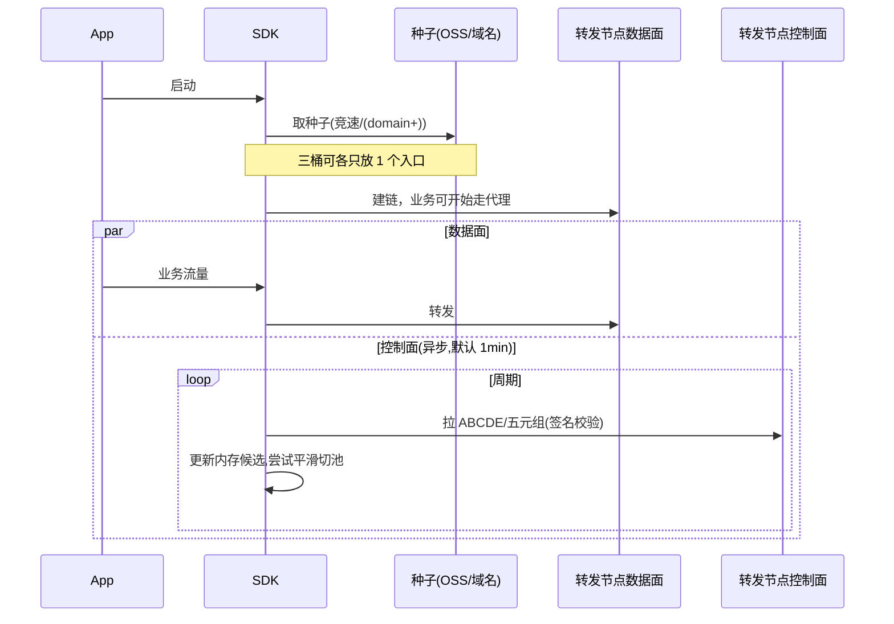

# 客户端发现与静默切换逻辑（APP / SDK）

本文描述终端侧 **「尽快连上 → 静默刷新 ABCDE → 不影响转发 → 全不可用兜底」** 的产品与技术约束，与《统一管控台系统设计》《统一管控台需求规格》一致，并兼容现有仓库 SDK（`Prepare`、固定选点、`app_domain` 兜底）。

---

## 1. 目标

| 目标 | 说明 |
|------|------|
| **尽快连通** | APP 启动后 **优先**用极小代价拿到至少 **一个可达转发入口**（种子），建立 SOCKS/本地代理，业务流量尽快可走。 |
| **静默刷新** | 在 **不打断** 用户当前会话的前提下，**异步**从「转发节点侧控制通道」获取 **各区真实入口或已为设备算好的五元组**，周期默认 **每分钟**（可配置）。 |
| **静默切换** | 新列表校验通过后，**后台**切换 SDK 连接池/上游目标；尽量避免整代理重启；失败则保留旧链路直至下一次成功。 |
| **暴露面最小** | **三个对象存储桶各仅放一个种子入口（例如各一 IP/域名）**；**公网 DNS 仅解析一个种子入口**，与 OSS 形成冗余，而非重复暴露全池。 |

---

## 2. 控制面与数据面必须分离

- **转发会话（透明代理字节）**与 **配置下发**不得在同一「纯双向 pipe」里混写指令（见《统一管控台系统设计.md》§2.3 演进路径）。  
- **第一期落地（已定稿）**：**单独一条 TLS 控制连接**（与 Relay **同端口**，**TLS ALPN** 区分；与转发会话仍是 **独立连接**），与 Relay **分层**；协议、HELLO/HMAC、下行 PUSH 与安全要求见 **《独立控制连接与安全.md》**。  
- 控制面 **QPS 低**，须 **限流 + 鉴权**（设备身份、MAC/HMAC、nonce、时间窗），避免打挂数据面。

---

## 3. 推荐时序（逻辑）

- **端口**：`Fwd` 与 `Ctrl` 对应 **同一监听地址**；SDK 侧为 **两条 TLS 连接**（数据面 ALPN 与控制面 ALPN 不同），见《独立控制连接与安全.md》。  
- **首包路径**：若首连即需完整 ABCDE，可 **第一次控制拉取在首连后立刻触发一次**（`interval=0` 的首次 + 之后每 60s），与「每分钟」不矛盾。  
- **与旧路径兼容**：未改协议前，仍可用 **`resolveControlPlane` 全量 `.dat`** 完成 `Prepare`；特性开关为 **仅种子 / 种子+隧道 / 全量回退** 多档。

---

## 4. 静默切换与「不影响流量」的约束

- 配置更新在 **独立 goroutine** 中完成；**不阻塞** `Start` 后读写路径。  
- 切换策略建议：  
  - **先探测** 新五元组可达性，再 **替换** 连接池上游；或  
  - **双跑短暂重叠**（新旧并存数秒）再停旧，降低闪断。  
- 若切换失败：**保留旧上游**，记录 `last_error`，下一周期重试。  
- **用户无感** 为努力目标；极端网络下允许短暂重连，应在指标里区分。

---

## 5. 从转发节点获取的节点「全部不可用」时

须定义 **确定性兜底链**（建议顺序写死并写测试）：

1. **重试隧道控制接口**（退避，避免雪崩）。  
2. **重新拉种子**：从 **OSS 三桶（仍各仅入口）** 与 **域名** 再取一遍种子 JSON（可能与上次相同，用于刷新 DNS/缓存）。  
3. **SDK 现有能力**：对 **全量控制面**（若仍保留应急 `.dat`）做一次 `Prepare` 式拉取；或 **`app_domain` DNS 兜底**（`bootstrap.Prepare` 已有语义）。  
4. **仍失败**：进入 **紧急状态**（熔断、提示、仅保留域名低频解析等，与 `sdk/bootstrap` 状态机一致方向）。  

> 要点：**种子层始终保留一条退路**；隧道层失败不等于全网无入口。

---

## 6. 与老客户端 / 特性开关

| 模式 | 行为 |
|------|------|
| **Legacy** | 仅 OSS/域名全量或现有 `Prepare`，无隧道刷新。 |
| **Hybrid** | 种子 + 现有 `Prepare` + 后台静默隧道刷新（推荐演进）。 |
| **Tunnel-first** | 种子仅 bootstrap，长期依赖隧道更新；全量 `.dat` 仅灾备。 |

由 **编译开关或远程配置** 控制，避免一刀切升级失败。

---

## 7. 验收要点（供测试方案引用）

- 首连 **TTFB/首包代理可用** 满足产品指标；一分钟内完成至少一次控制拉取（若网络允许）。  
- 压测控制接口：**数据面转发吞吐**在控制面被打满限流时 **不明显劣化**。  
- 模拟「隧道返回的五节点全死」：客户端 **按 §5 兜底链** 可恢复或进入可观测失败状态，**无死循环/spin**。  
- 三桶 **仅种子**、域名 **单入口** 时，公网不可枚举全池。

---

## 8. 文档关系

- **需求**：见《统一管控台需求规格》§4.7（演进路径）及验收 **AC-U10 / AC-U11**（隧道与种子策略）。  
- **设计**：见《统一管控台系统设计》§2.3（双种子 + **独立控制连接**、服务端选点）；传送与安全细节见 **《独立控制连接与安全.md》**。  
- **测试**：见《统一管控台测试方案》UT-TUN / IT-TUN / E2E-04，并为本文件 §5 增加 **兜底链集成用例**（可记为 IT-FB-01…）；控制连接专项见 **DC-01～DC-05**。
