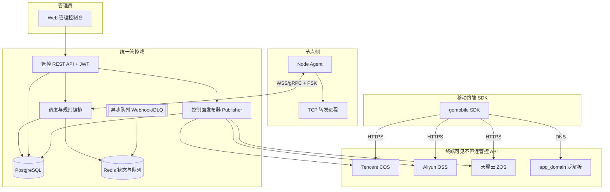

# 统一管控台系统设计（对接现有终端 SDK）

## 1. 设计目标

构建 **单一管理域**：在同一套后台维护 **全部转发节点**、**Agent 规则与状态**，以及 **终端可见的控制面制品**。

**终端约束**：SDK 通过 **`resolveControlPlane` → 对象存储 HTTPS → AES 解密** 得到 `nodesA`～`nodesE`；失败时 **`app_domain` DNS** 兜底（`sdk/controlplane.go`、`sdk/bootstrap.go`）。Publisher 生成的路径、密文与明文结构 **必须与 SDK 完全一致**。

---

## 2. 逻辑架构



**要点**：SDK **只访问**对象存储与域名；管控通过 **Publisher** 写入三云；第三方系统仅可通过 **Webhook** 订阅事件，不参与节点注册主路径。

### 2.1 管控域逻辑组件

| 组件 | 职责 |
|------|------|
| **Scheduler** | 综合评分选点；Zone/ISP/云/标签约束；业务线 **PlatformSchedulePolicy**；超载与信誉过滤。 |
| **GrayManager** | 灰度状态机、晋升/降级、与失败率摘除联动。 |
| **BlackholeProber** | 对转发端口 TCP 探活、ProbeRTT、丢包率、**blackhole** 标记。 |
| **ReputationManager** | 信誉分维护、观察名单、与调度联动。 |
| **CostController** | 利用率统计、低利用率告警、回收编排与审计。 |
| **ConfigVersionManager** | 配置快照、历史、回滚及节点重下发。 |
| **WebhookDispatcher** | Webhook 入队、Worker、重试、DLQ、**CircuitBreaker**。 |
| **AlertManager** | 告警生命周期、与面板/Webhook 联动。 |

模块可合并部署为单体服务或拆 Worker；**PostgreSQL** 存配置与审计，**Redis** 存在线状态、心跳高频字段与任务队列。

### 2.2 存储分层

| 数据 | 介质 | 说明 |
|------|------|------|
| 在线状态、最新心跳 | Redis Hash + TTL | 毫秒级读 |
| HealthMetrics | Redis Sorted Set 等 | 排序与范围查询 |
| Webhook / 异步任务 | Redis List 或 Kafka | 重试、DLQ |
| 节点、规则、ConfirmedVersion | PostgreSQL | 事务 |
| ConfigVersion 快照 | PostgreSQL | 回滚 |
| 利用率、信誉日志、告警、故障转移 | PostgreSQL | 审计 |
| 心跳历史（如 7 天） | PostgreSQL 分区表 | 生命周期裁剪 |

### 2.3 演进：双入口种子 + 按设备固定五元组

**目标**：公开面尽量只暴露 **种子**；完整路由知识经 **加密控制通道** 等与 SDK 对齐的方式下发，避免向所有终端广播同一套全池明文。

#### 双入口（冗余）

| 入口 | 内容形态 |
|------|----------|
| **COS/OSS/ZOS 种子桶** | 极简：单 `host:port`、短密文或下一跳 JSON |
| **域名（与 app_domain 同类）** | 与 OSS **同级**冷启动；镜像或互补策略须在版本说明中固定 |

客户端：**先连上种子所指转发入口**，再进入控制面数据下发阶段。

#### 固定集合与 SDK 同源算法

设备 ID = SDK 持久化 **`device UUID`**。每组 `nodesK`（K ∈ A…E）：

`idx = hash64(deviceUUID + "|" + K) % len(nodesK)`，`hash64` = **FNV-1a 64**（`sdk/nodes.go`）。

**实现二选一（须锁定）**：

1. **服务端选点**：转发侧存全池，按上式算五条 endpoint，经控制通道下发 **5 条 + config_version + MAC/HMAC**。  
2. **客户端选点**：经授权下发分组密文，终端本地 **`SelectFixedNodeSet`**（体积与泄露面较大）。

**传输**：**独立 TLS 控制连接**，与 Relay **同端口、ALPN 分流**；协议与安全见《独立控制连接与安全.md》。控制面 **不**在 obfs 字节流内复用帧协议。

#### 与 Publisher

- **兼容期**：全量 `.dat` 继续用于未演进客户端。  
- **演进后**：种子制品 + 隧道并行；全量对象可改为应急回退并收紧 ACL。

---

## 3. 模块划分

### 3.1 管控 REST API

除登录外接口须 **JWT**；多租户下 Token 含租户 ID，接口层过滤数据范围。

#### 认证

| 方法 | 路径 | 说明 |
|------|------|------|
| POST | `/api/v1/auth/login` | 登录，返回 JWT |
| POST | `/api/v1/auth/logout` | 登出（客户端丢弃 Token） |

#### 业务线（库存表名可为 `platforms`，语义为路由/业务分类）

| 方法 | 路径 | 说明 |
|------|------|------|
| GET | `/api/v1/platforms` | 列表（租户隔离） |
| POST | `/api/v1/platforms` | 新建 |
| PUT | `/api/v1/platforms/:id` | 更新，生成 ConfigVersion |
| DELETE | `/api/v1/platforms/:id` | 删除（有关联节点则拒绝） |
| POST | `/api/v1/platforms/:id/test` | 对配置的 URL 做连通性探测 |
| GET | `/api/v1/platforms/:id/versions` | 配置版本历史 |
| POST | `/api/v1/platforms/:id/rollback` | 回滚到指定版本 |
| GET | `/api/v1/platforms/:id/schedule-policy` | 读取调度策略 |
| PUT | `/api/v1/platforms/:id/schedule-policy` | 更新 **PlatformSchedulePolicy** |

#### 节点

| 方法 | 路径 | 说明 |
|------|------|------|
| GET | `/api/v1/nodes` | 列表（筛选：业务线、区域、ISP、标签等） |
| POST | `/api/v1/nodes` | 新建（默认可进灰度区） |
| GET | `/api/v1/nodes/:id` | 详情（含信誉分、ConfirmedVersion） |
| PUT | `/api/v1/nodes/:id` | 更新 |
| DELETE | `/api/v1/nodes/:id` | 删除 |
| POST | `/api/v1/nodes/:id/enable` | 启用转发 |
| POST | `/api/v1/nodes/:id/disable` | 禁用转发 |
| POST | `/api/v1/nodes/:id/promote` | 灰度→正式 |
| POST | `/api/v1/nodes/:id/demote` | 正式→灰度 |
| POST | `/api/v1/nodes/:id/labels` | 更新标签 |
| POST | `/api/v1/nodes/:id/reclaim` | 触发回收编排 |
| GET | `/api/v1/nodes/:id/utilization` | 利用率历史 |
| GET | `/api/v1/nodes/:id/reputation` | 信誉分历史 |
| POST | `/api/v1/nodes/batch-rule` | 批量下发规则 |

#### 监控与告警

| 方法 | 路径 | 说明 |
|------|------|------|
| GET | `/api/v1/monitor/overview` | 概览 |
| GET | `/api/v1/monitor/nodes` | 全量实时状态 |
| GET | `/api/v1/monitor/heartbeats` | 心跳历史 |
| GET | `/api/v1/monitor/cluster` | 集群与 Leader |

| 方法 | 路径 | 说明 |
|------|------|------|
| GET | `/api/v1/alerts` | 告警列表 |
| PUT | `/api/v1/alerts/:id/resolve` | 解决 |

#### 任务与租户

| 方法 | 路径 | 说明 |
|------|------|------|
| GET | `/api/v1/tasks/dlq` | 死信队列 |
| POST | `/api/v1/tasks/dlq/:id/retry` | 手动重试 |
| GET | `/api/v1/tenants` | 租户列表（超管） |
| POST | `/api/v1/tenants` | 创建租户 |
| PUT | `/api/v1/tenants/:id` | 配额等 |

#### 控制面发布（统一管控必备）

| 方法 | 路径 | 说明 |
|------|------|------|
| POST | `/api/v1/control-plane/publish` | 触发构建与上传 |
| GET | `/api/v1/control-plane/preview-urls` | 当日三云完整 URL |
| GET | `/api/v1/control-plane/publish-history` | 发布历史与校验和 |

**说明**：业务线资源上的「外部 URL」字段仅用于 **运维探测或 Webhook 配置**，**不是**节点在第三方注册的强制性通道。

### 3.2 Node Agent

**职责**：注册、心跳、`apply_rules`、**rule_ack**、本地 WAL/快照、转发引擎。

规则中含 **`ObfuscationConfig`**（见下文物 JSON）；协议栈与现有 `server/`、obfs 实现一致。

#### 3.2.1 控制通道与消息

**连接**：WebSocket（示例路径如 `/ws/node`）或 gRPC 双向流。

**握手 Header（示例）**：`X-Node-PSK`、`X-Node-ID`、`X-Tenant-ID`（多租户时）。

**消息外壳**：

```json
{ "type": "消息类型", "seq": 12345, "payload": {} }
```

**消息类型**

| 方向 | type | 说明 |
|------|------|------|
| Node → Master | `register` | 注册 |
| Master → Node | `register_ack` | 含节点 ID、Leader 地址 |
| Node → Master | `heartbeat` | HealthMetrics |
| Master → Node | `heartbeat_ack` | — |
| Master → Node | `apply_rules` | 含 **rule_version** 与规则数组 |
| Node → Master | `rule_ack` | 已确认 rule_version |
| Node → Master | `rules_result` | 应用明细错误 |
| Master → Node | `disable_forward` | 禁用 |
| Master → Node | `leader_redirect` | 切 Leader |
| Master → Node | `update_obfuscation` | 更新混淆参数 |
| Master → Node | `probe_request` | 黑洞协同探活（若启用） |
| Node → Master | `probe_response` | 探活响应 |

**`apply_rules` 示例**

```json
{
  "type": "apply_rules",
  "seq": 100,
  "payload": {
    "rule_version": 42,
    "rules": [
      {
        "rule_id": "r-001",
        "local_port": 10001,
        "target_ip": "10.0.0.1",
        "target_port": 8080,
        "enabled": true,
        "obfuscation": {
          "mode": "tls",
          "random_port_range": [10000, 20000],
          "max_bandwidth_mbps": 100,
          "mux_enabled": true,
          "random_padding": false
        }
      }
    ]
  }
}
```

**`rule_ack` 示例**

```json
{
  "type": "rule_ack",
  "seq": 101,
  "payload": {
    "node_id": "node-001",
    "rule_version": 42,
    "status": "applied",
    "timestamp": 1700000000
  }
}
```

**混淆模式（Node 侧）**

| mode | 说明 |
|------|------|
| `plain` | 直接 TCP 转发 |
| `tls` | 监听侧 TLS 握手（如自签证书） |
| `http` | HTTP/WebSocket 封装 |

附加能力：随机端口范围、yamux/smux 类 **MUX**、令牌桶限速、随机填充、源 IP 滑动窗口限流。

#### 3.2.2 rule_version、ACK 与 Leader 补发

- 下发后 **10s** 等待 ACK；超时 **重试至多 3 次**、间隔 **5s**；失败 → `config_error` + **`rule_ack_timeout`**。  
- 节点：`rule_version` ≤ 当前已应用 → 丢弃载荷，ACK **当前版本**。  
- 新 Leader：读取 **ConfirmedVersion**，对落后节点补发。

#### 3.2.3 WAL、快照与清理

- **WAL**：每行 JSON，`op`: `apply` | `disable`，含 `rule_version`、规则或 rule_id、时间戳。  
- **快照**：含 `snapshot_version`、`rules[]`、`snapshot_time`；周期如 **60s**。  
- **重启**：加载最新快照 → 回放快照时间之后的 WAL → 连接管控拉最新规则。  
- **清理**：快照成功后删旧 WAL；WAL 可按天保留（如 **3 天**）；快照保留最近 **2** 份。

#### 3.2.4 黑洞探测

- 周期 **60s**（可配）对 **转发端口** TCP 连接探活，记 **ProbeRTT**。  
- `|ProbeRTT - avg_latency| > 200ms` → 延迟异常告警。  
- 连续失败或滑动窗口丢包率 **>30%** → **`blackhole_detected`**、摘除、故障转移。  
- 恢复：可要求连续 **5 次**探活成功且 RTT 差 **&lt;100ms** 后解除 blackhole，进入 **灰度**再观察。

### 3.3 控制面发布器（Publisher）

**输入**：DB 中 **`pool_a`～`pool_e`**（或等价）→ JSON **`nodesA`～`nodesE`**。

**处理**：`remoteNodePayload` 明文 → 按 SDK 分支 **AES** 加密 → PUT 三云。

**路径算法**（须与 SDK 同源）：北京 `YYYYMMDD`、`shortMD5(date + app_name + "cos"|"oss"|"zos" + sdk_version)`、COS/OSS/ZOS URL 格式（见 `sdk/controlplane.go`）。

**发布事务**：DB 写入 **ControlPlanePublishRecord**（`content_sha256`、`beijing_date`、`urls_snapshot`、`operator_id` 等）。

### 3.4 Webhook 与异步队列

节点上下线、告警等事件 **异步 POST** 至配置 URL：

- 入队 → Worker 消费；失败重试 **≤3 次**，间隔 **10s**；超限入 **DLQ**，可查询与 **`/tasks/dlq/:id/retry`**。  
- **CircuitBreaker**（按 Webhook 基址或租户配置）：**60s** 内连续失败 **&gt;5** → **Open**，拒绝新投递；**30s** 后 **HalfOpen** 探活；成功 → **Closed**。  
- **不参与** Publisher 写对象存储的主路径。

---

## 4. 与终端 SDK 行为对照

| SDK 行为 | 管控侧责任 |
|----------|------------|
| `buildNodeDataURLs` 三 URL 竞速 | 三云各上传一致密文；缺一 URL 则 SDK 该支路失败，需运维或改策略 |
| 304 / 本地缓存 | 发布后 ETag/Last-Modified 变化；提示客户端缓存 TTL |
| `app_domain` | 文档化期望解析；DNS 运维负责 |
| `SelectFixedNodeSet` | 维护各组列表 **顺序**（影响取模）；演进时隧道侧算法与 SDK **同源** |
| `pickByUUID` | 服务端选点时 **同 UUID、同分区名、同组内顺序** |

---

## 5. 数据模型

### 5.1 租户与业务线

**Tenant**：`id`、`name`、`api_quota`、`status`。

**Platform（业务线）**：`id`、`tenant_id`、`name`、可选探测 URL、**源站列表**（类型、IP、端口、优先级）、`created_at` / `updated_at`。  
不再强制「第三方注册 API」字段；Webhook 目标可独立配置在通知子系统。

### 5.2 节点与标签

**Node**：`id`、`tenant_id`、`ip`、`platform_id`、`forward_port`、`zone`（A/B/C/D/standby/gray）、`isp`、`cloud_provider`、`labels`、`weight`、`max_conns`、`max_bandwidth`、`status`（online/offline/unavailable/config_error/quality_degraded/gray_failed/blackhole/…）、`reputation_score`（0～100，默认 80）、`confirmed_version`、`last_heartbeat`、时间戳。

**NodeLabel**：`node_id`、`key`、`value`。

### 5.3 转发规则

**ForwardRule**：`node_id`、`rule_version`、`local_port`、`target_ip`、`target_port`、`enabled`、`obfuscation`（**ObfuscationConfig**：`mode`、`random_port_range`、`max_bandwidth_mbps`、`mux_enabled`、`random_padding` 等）。

### 5.4 运行时指标与探活

**NodeHealthMetrics**（常用 Redis）：`success_rate`、`avg_latency`、`conn_fail`、`active_conns`、`bandwidth_mbps`、`updated_at`。

**NodeProbeResult**：`probe_rtt`、`packet_loss`、`consec_fail`、`last_probe_at`。

### 5.5 告警与审计

**Alert**：`type`（如 `node_offline`、`standby_exhausted`、`blackhole_detected`、`rule_ack_timeout`、…）、`status`（active/resolved）、关联 `node_id` / `tenant_id`。

**FailoverLog**、**NodeReclaimLog**、**NodeReputationLog**、**NodeUtilizationHistory**：字段见需求规格故障转移/成本/信誉等小节。

### 5.6 配置版本与发布

**ConfigVersion**：`resource_type`、`resource_id`、`version`、`snapshot` JSON、`changed_by`、`change_summary`、`is_rollback`、`created_at`。

**ControlPlanePublishRecord**（管控增量）：`id`、`content_sha256`、`published_at`、`operator_id`、`beijing_date`、`urls_snapshot`。

### 5.7 调度策略

**PlatformSchedulePolicy**：`label_selector`（`LabelRequirement`：`key`、`operator` In/NotIn/Exists、`values`）、`zone_weights`（如 A:50,B:30,C:20）、`max_conns_per_node`（0=全局）、`enable_rep_filter`、`updated_at`。

**优先级**：业务线策略覆盖全局默认；无配置字段则回落全局。

### 5.8 节点池与 SDK 分组

**NodePoolAssignment**：`node_id` → **`group_role`** ∈ {`A`,`B`,`C`,`D`,`E`}；一期建议每节点 **单组**。

---

## 6. 部署拓扑

| 组件 | 说明 |
|------|------|
| 管控 API | 无状态多副本 + 负载均衡 |
| Publisher | 独立 Worker 推荐（对象存储凭证隔离、限流） |
| PostgreSQL / Redis | 主从或托管服务 |
| 对象存储写凭证 | 仅 Publisher 持有 |

---

## 7. 安全

- **AES**、签发 Token 的 **RSA 私钥** 存 KMS / 环境变量，轮换策略落地。  
- 发布高风险操作可选 **双人复核**。  
- **审计**：管理员操作、发布批次、回滚记录可追溯。

---

## 8. 分期建议

| 阶段 | 内容 |
|------|------|
| **MVP** | 节点纳管 + 规则 + ACK + Publisher 三云 + 文档化 app_domain；Webhook 可选 |
| **演进期** | 种子双入口 + 控制连接按设备下发 + 收紧全量 `.dat` |
| **二期** | 智能调度、灰度、信誉、黑洞探活、标签与业务线策略 |
| **三期** | 多租户强隔离、成本回收自动化 |

---

## 9. 横切算法与状态机

### 9.1 Leader 选举与 Agent 重连

- **etcd** 租约抢主或 **Raft** 日志复制；故障后目标 **约 10s** 内完成新 Leader（与参数相关）。  
- 选举中：**写请求 503**，读默认可读（与实现一致声明）。  
- Agent：断线指数退避（上限 **60s**）；收到 **`leader_redirect`** 立即连新地址。

### 9.2 调度评分（默认权重示例）

```
Score =
  0.25 * normalize(weight)
+ 0.20 * (1 - normalize(latency))
+ 0.20 * success_rate
+ 0.10 * (1 - normalize(active_conns))
+ 0.10 * (1 - normalize(bandwidth))
+ 0.15 * normalize(reputation_0_100)
```

`normalize(x)` 将各维度映射到 0～1；`success_rate`、`reputation` 已在 0～1 或按字段定义缩放。同分随机；先应用 **PlatformSchedulePolicy** 过滤再排序。

### 9.3 信誉分（事件驱动）

- 初值 **80**。  
- 某小时在线满且成功率 ≥ **0.95**：**+1**（上限 100）。  
- 故障转移被替换：**−10**；黑洞判定：**−20**；灰度失败：**−5**（下限 0）。  
- **&lt;30**：不进正式区调度，可作备用。

### 9.4 灰度状态（摘要）

新节点 → **GrayZone** →（达标）**Active** 或（不达标）**GrayFailed**；**Active** 可与 **Standby** 互换；**Active** → **Unavailable** / **Blackhole**；黑洞恢复 → 回 **GrayZone**。

### 9.5 成本回收（摘要）

每分钟写利用率；连续 **6 小时**低于阈值 → 告警；回收：**Scheduler** 选迁移目标 → 下发规则并 ACK → 下线源节点 → **NodeReclaimLog**；自动策略默认 **关**。

### 9.6 配置回滚

读取目标 **ConfigVersion.snapshot** → 写入 DB（新版本记录，`is_rollback=true`）→ 生成新 **rule_version** 并向受影响节点 **`apply_rules`**。

### 9.7 熔断器（Webhook）

状态机：**Closed → Open**（60s 内失败 &gt;5）→ **HalfOpen**（30s 后）→ 探活成功 **Closed** / 失败 **Open**。

### 9.8 正确性属性（节选，验收与测试追溯）

| ID | 陈述（摘要） |
|----|----------------|
| P1 | 心跳超过 90s 未更新 → 节点不得仍为「在线」 |
| P2 | 成功率 &lt;0.9 或延迟 &gt;500ms → 不得标记为正常在线 |
| P3 | 故障转移后备用节点规则集合与原节点一致 |
| P4 | enabled 规则对应端口必监听；disabled 必关闭 |
| P5 | 重复下发同一 rule_version 不改变最终端口集合 |
| P10 | Webhook 单项失败重试不超过 3 次后进入 DLQ |
| P11 | 熔断 Open 期间不向该目标发起新 HTTP |
| P18 | Leader 切换后 ConfirmedVersion 落后节点最终被补发一致 |
| P20 | 黑洞丢包率条件满足时必须 blackhole 告警并标记 |
| P27 | ACK 重试不超过 3 次后标记 config_error |

完整属性驱动的单元/属性测试可在实现阶段扩展编号。

---

## 10. 参考代码路径（仓库内）

| 路径 | 说明 |
|------|------|
| `sdk/controlplane.go` | URL 构建、`resolveControlPlane`、`decryptNodeData` |
| `sdk/bootstrap.go` | `Prepare`、域名兜底 |
| `sdk/nodes.go` | `SelectFixedNodeSet`、`pickByUUID`、`hash64` |
| `sdk/secret.go` | Secret 字段 |

《客户端发现与静默切换逻辑.md》《独立控制连接与安全.md》描述终端侧运行时与控制 TLS。

需求全文见《**统一管控台需求规格.md**》；测试见《**统一管控台测试方案.md**》。
